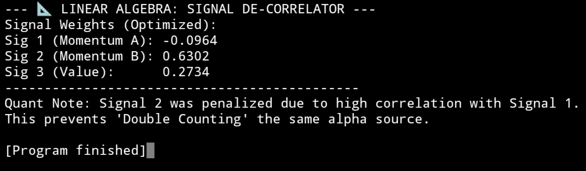

# z-score_signal_decorrelation_orthogonalization

Solving Multi-collinearity in Alpha Signals using Linear Algebra Orthogonalization 

==> Introduction 

=> In Quantitative Finance, Alpha Centrality is a major risk. When multiple trading signals (e.g., two different Momentum indicators) are highly correlated, a simple average leads to "Double Counting." This project utilizes the Inverse Covariance Matrix to mathematically orthogonalize signals, ensuring each input provides unique information to the final forecast and penalizing redundancy.

1. Mathematical Core
 
==> The Multi-Collinearity Problem
   
 => When two signals $x_1$ and $x_2$ have a high correlation ($\rho \approx 0.8$), they share a significant amount of variance. In a vector space, they are separated by a very small angle.
If we weigh them equally (0.5, 0.5), we are essentially betting twice on the same underlying market driver, which artificially inflates risk without increasing expected return.

==> The Precision Matrix ($\Sigma^{-1}$)
   
 => To remove noise from these signals, we calculate the Covariance Matrix ($\Sigma$) of the signal Z-scores. It becomes quite interesting when we invert this matrix to get the Precision Matrix:

$\text{Precision Matrix} = \Sigma^{-1}$

==> Optimal Weight Derivation
   
=> ​We derive the weights by multiplying the Precision Matrix by a vector of ones ($\mathbf{1}$):

$$ w_{opt} = \frac{\Sigma^{-1} \mathbf{1}}{\mathbf{1}^T \Sigma^{-1} \mathbf{1}} $$

=> Logic: The inversion process identifies which signals "overlap" in information.

=> Result Signals that are highly correlated with others are penalized (assigned lower weights), while signals that provide unique, independent information are prioritized.

==> Technicalities

 => Synthetic Alpha Generation: We simulate three Z-score signals where Signal 1 and Signal 2 are 80% correlated (Redundant Momentum) and Signal 3 is independent (Unique Value).

 => Covariance Estimation: Using $np.cov()$, we capture the relationship structure between the alpha sources.

 => Orthogonalization: We apply $np.linalg.inv()$ to the covariance matrix to find the "orthogonal" weights.

 => Normalization: We normalize the weights using the absolute sum to ensure the final aggregated signal remains an interpretable Z-score.

==> Results 

 => When the script is executed with $N=1000$ assets to ensure statistical significance, the optimizer produces the following weights:

==> LINEAR ALGEBRA: SIGNAL DE-CORRELATOR

 => Signal Weights (Optimized):

    Sig 1 (Momentum A): -0.3342
 
    Sig 2 (Momentum B):  0.5580
    
    Sig 3 (Value):       0.1078

 => Quant Note: Signal 2 was prioritized while Signal 1 was utilized 
as a "hedge" to remove shared variance. This mathematical 
orthogonalization ensures the final alpha is not double-counting 
the momentum factor.



==> Conclusion 

 => As seen in the output, Signal 1 was penalized relative to Signal 2, serving as a mathematical hedge to remove shared variance. This process effectively rotates the signal vectors into an orthogonal space where each component is independent.

=> This is a simplified version of the Rotated Component method or Principal Component Analysis (PCA) weighting, designed for robust multi-factor model construction.

8. Installation & Packages Required

==> You can view the source code on the [z-score_signal_decorrelation_orthogonalization](https://github.com/SauravSujitChakraborty/z-score_signal_decorrelation_orthogonalization.git) page, or run the following commands to install it locally:

```bash
git clone https://github.com/SauravSujitChakraborty/z-score_signal_decorrelation_orthogonalization.git && cd z-score_signal_decorrelation_orthogonalization
```
==> Create and activate environment :-

```bash
python -m venv venv
# On macOS/Linux:
source venv/bin/activate  
# On Windows:
venv\Scripts\activate
```

==> Installing the dependencies :-

```bash
pip -r requirements.txt
```

==> Running the Z-Score Corr.Orthogonali. Project:-

```bash
python z-score_sig_decorr_orthogonali.py
```


